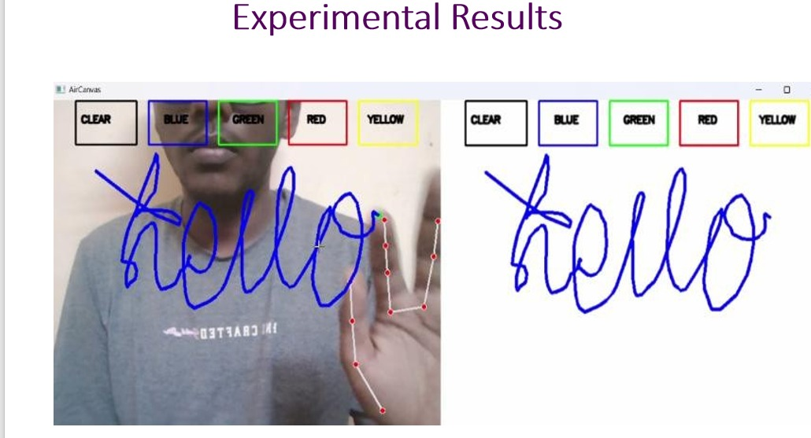

# AirWrite Translator

Touchless, gesture-based handwriting recognition and translation. Write
in the air with your fingertip in front of a webcam, and see it
recognized and translated in real time.



## Overview

AirWrite Translator tracks your hand through a webcam using MediaPipe,
lets you "write" by raising your index finger and moving it like a pen,
and turns your air-written strokes into recognized text using a
fine-tuned TrOCR model — then translates that text automatically.

## Problem Statement

Handwriting input normally needs dedicated hardware: a touchscreen, a
stylus, or physical paper. There's no lightweight, camera-only way to
quickly write a word in the air and have it recognized and translated,
without touching anything.

## Proposed Solution

AirWrite Translator only needs a standard webcam. It tracks the index
fingertip in real time, treats a raised finger as "pen down," and
renders the resulting strokes on a virtual canvas. When you're done, one
gesture triggers OCR (via a fine-tuned TrOCR model) and automatic
translation, with the results shown immediately alongside the canvas.

## Key Features

- ✋ Touchless handwriting using hand gestures
- 🎨 Multi-color virtual air canvas with an on-screen toolbar
- 🖐️ Real-time hand and fingertip tracking (MediaPipe)
- 📝 Handwritten text recognition using a fine-tuned TrOCR model
- 🌐 Automatic translation (Tamil by default, configurable)
- 🖥️ Combined live webcam + canvas display
- 💾 Automatic logging of recognized/translated text and canvas snapshots

## How It Works

```
Camera Input
    ↓
Hand Detection
    ↓
Air Writing
    ↓
Character Recognition (TrOCR)
    ↓
Translation
    ↓
Output
```

See [`docs/architecture.md`](docs/architecture.md) for how this maps to
the actual code, and [`docs/project-overview.md`](docs/project-overview.md)
for the full problem/solution writeup.

## Technology Stack

- Python
- OpenCV
- MediaPipe
- NumPy
- TrOCR (Hugging Face Transformers, `torch`, `sentencepiece`)
- deep-translator (Google Translate)
- Pillow

## Project Structure

```
AirWrite-Translator/
│
├── README.md
├── requirements.txt
├── .gitignore
├── LICENSE
├── main.py                      # Thin launcher -> src/main.py
│
├── src/
│   ├── main.py                  # Application entry point / camera loop
│   ├── core/
│   │   ├── hand_tracking.py     # MediaPipe hand detection + gesture check
│   │   └── drawing_engine.py    # Stroke buffers, canvas, buttons
│   ├── recognition/
│   │   └── ocr.py               # TrOCR model loading + inference
│   ├── translation/
│   │   └── translator.py        # Google Translate wrapper
│   ├── ui/
│   │   └── display.py           # Overlays, buttons, combined view
│   └── utils/
│       ├── config.py            # All constants / tunables
│       └── helpers.py           # Snapshot + CSV logging
│
├── output/                      # Demo screenshots
│   ├── README.md
│   ├── airtrans.png
│   └── translation.png
│
├── docs/
│   ├── project-overview.md
│   ├── architecture.md
│   ├── installation.md
│   └── usage.md
│
├── tests/
│   ├── test_recognition.py      # Image preprocessing tests
│   ├── test_translation.py      # Translation wrapper tests
│   └── test_utils.py            # Drawing engine / canvas tests
│
└── assets/
    └── README.md                # Reserved for future icons/resources
```

## Installation

```bash
git clone <repository-url>
cd AirWrite-Translator
python -m venv venv
source venv/bin/activate    # Windows: venv\Scripts\activate
pip install -r requirements.txt
```

A fine-tuned TrOCR model is also required — see
[`docs/installation.md`](docs/installation.md) for how to point the app
at your model directory via the `AIRWRITE_MODEL_PATH` environment
variable.

## Usage

```bash
python main.py
```

Raise your index finger to draw, move your fingertip over a toolbar
button to select a color or clear the canvas, and hover over
**RECOGNIZE** to run OCR and translation. Full controls are documented in
[`docs/usage.md`](docs/usage.md).

## Running Tests

```bash
pip install pytest
pytest
```

## License

This project is licensed under the [MIT License](LICENSE).
